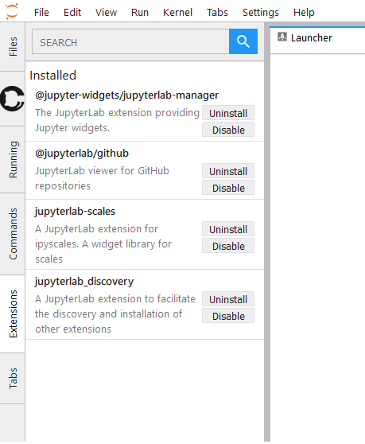

JupyterLab Discovery
====================

:Version:
    |release|
:Source code:
    `Github page`_

**jupyterlab-discovery** is a `JupyterLab`_ extension for discovering and managing other
JupyterLab extensions. The extension adds a side-bar component to JupyterLab, that
allows the user to:

- View the currently installed extensions and their status.
- Search and discover other extensions published to the npm registry.
- Install, uninstall, enable, disable and update extensions.

   Figure: Base view of the extension sidebar.

Quickstart
----------

To install the extension, run the following command on the JupyterLab server,
e.g. from the JupyterLab `terminal`_::

    pip install jupyterlab-discovery

This will install both the front-end extension, as well as the required server
extension.

Contents
--------

.. toctree::
   :maxdepth: 2
   :caption: Installation and usage

   usage

.. toctree::
   :maxdepth: 2
   :caption: Development

   extension-authors
   develop-install

.. links

.. _`JupyterLab`: http://jupyterlab.readthedocs.io

.. _`terminal`: http://jupyterlab.readthedocs.io/en/stable/user/terminal.html

.. _`Github page`: http://github.com/vidartf/jupyterlab_discovery