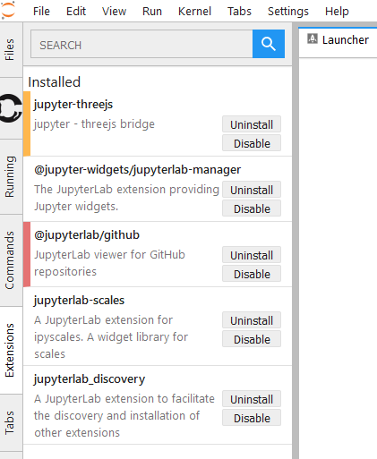
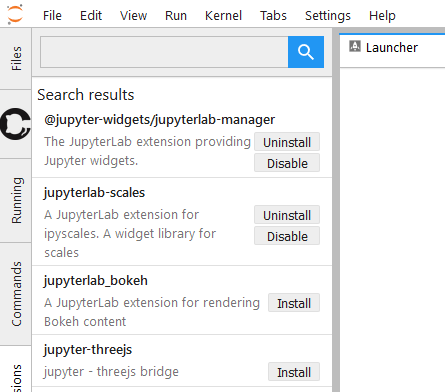
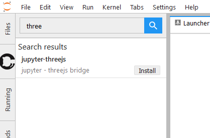
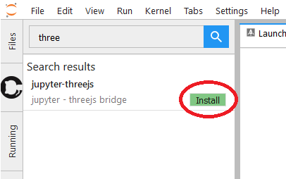
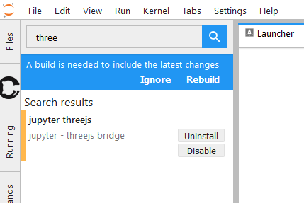
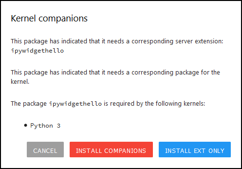
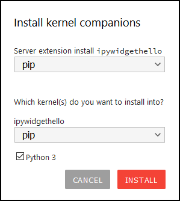

Usage
=====

When starting JupyterLab, the extension will query the server about which
extensions are installed, and their status. Once this information has been
obtained, the base view of the extension panel will look something like
this:

.. figure:: images/base-state.png
   :alt: Base view of the extension sidebar

   Figure: Base view of the extension sidebar.

In this view, you can see the installed extensions, and uninstall or disable
extensions. The status of extensions can also be seen by colored borders on
the left-hand side of each entry:

- a red border indicates an error with the extension, typically that the
  installed version is incompatible with the current version on JupyterLab.

- a yellow/orange border indicates that changes have been made to the
  extension, and that a :ref:`rebuild <rebuilding>` of JupyterLab is needed.

   Figure: The extension state indicators.

.. _searching:

Searching
---------

You can search for extensions on the `NPM registry`_ by using the search bar
on the top of the extension panel. Simply typing a space will allow you to
see all available extensions.

   Figure: An empty search (single space) will list all available extensions.

   Figure: By entering text in the search bar, the search is limited.

.. note::

    If you are an extension author, see the
    :ref:`section for extension authors<extension-authors>` for
    instructions on how to make your extension discoverable.

.. _installing-an-extenion:

Installing an extension
-----------------------

Once you have found an extension you want to install, simply click its
'Install' button.

   Figure: The install button.

.. danger::

    Installing an extension allows it to execute arbitrary code on the
    server, kernel, and in the client's browser. You should therefore
    avoid installing extensions you do not trust, and watch out for
    any extensions trying to mascerade as a trusted extension.

.. _rebuilding:

Rebuilding
----------

A while after starting the install of an extension, a drop-down should
appear under the search bar indicating that the extension has been
downloaded, but that a rebuild is needed to complete the installation.

   Figure: The rebuild indicator.

To trigger a rebuild, click the 'Rebuild' button. This will start the rebuild
in the background. Once the rebuild completes, a dialog will pop up,
indicating that a reload of the page is needed in order to load the latest
build into the browser.

Instead of rebuilding immediately, you can choose to postpone the rebuild
to a more appropriate time by clicking the 'Ignore' button on the drop-down.
When you are ready, reload the page (or open a new tab to the same server)
to trigger a new build check.

.. _companion-packages:

Companion packages
------------------

During installation of an extension, Discovery will inspect the package
metadata for any
:ref:`instructions on companion packages<ext-author-companion-packages>`.
Companion packages can be:

   - Notebook server extensions (or any other packages that need to be
     installed on the Notebook server).
   - Kernel packages. An example of companion packages for the
     kernel are Jupyter Widget packages, like the `ipywidgets`_
     Python package for the
     `@jupyter-widgets/jupyterlab-manager package`_.

If Discovery finds instructions for companion packages, it will prompt
you about what to do.

   Figure: The companion package information dialog.

The available actions are:

Install Extension Only:
   Only install the JupyterLab extension, ignoring any companion
   packages.

Install Companions / Install in Kernel / Install Server Extension:
   The text of this button depends on which companion package types
   the metadata indicates are available. In all cases, it will show
   another dialog asking for more input on what to install, and how.
   After that, it will try to install the packages into the kernel
   and/or Notebook server.

Cancel:
   Do nothing.

   Figure: The companion package install dialog. This example package
   includes both an server extension and a kernel package for Python.
   The drop-downs select how to install the packages. The available
   options are an intersection between what Discovery supports and
   what the package metadata indicates as valid options.

.. warning::
   The option to install companion packages is still experimental,
   and while it works for the most common setups, it makes no
   guarantees. Use at your own risk.

.. links

.. _`NPM registry`: https://docs.npmjs.com/misc/registry

.. _`ipywidgets`: https://ipywidgets.readthedocs.io

.. _`@jupyter-widgets/jupyterlab-manager package`: https://www.npmjs.com/package/@jupyter-widgets/jupyterlab-manager
